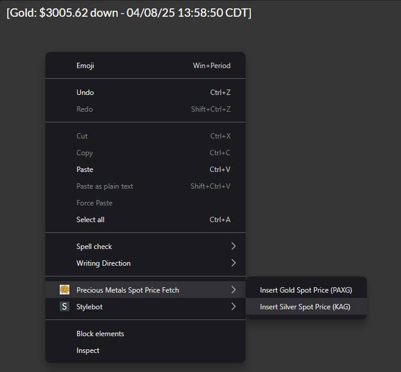

# SpotFetch
A browser extension for Chrome and Brave that allows you to fetch the prices of Gold and Silver from the Coingecko equivalents of gold and silver (backed 1:1)
# Gold and Silver Spot Price Extension

A Chrome/Brave extension to insert live gold and silver spot prices into text fields on websites like X and Gab. This tool is designed for users who want to quickly share up-to-date precious metal prices in their posts or messages.

## Features
- Fetches live gold (PAXG) and silver (KAG) prices from CoinGecko every 5 minutes.
- Inserts prices with a direction indicator ("up," "down," "unc") based on price changes, along with a timestamp in the format `[Gold: $3003.31 up - 04/08/25 13:33:45 CDT]`.
- Supports multiple platforms, including X and Gab, handling various text editors (e.g., Draft.js, custom `contenteditable` elements).
- Uses cartoonish gold and silver coin icons for a playful visual identity.
- Ensures compatibility with JavaScript-heavy sites by simulating user actions (e.g., paste events for Draft.js editors).

## Installation
1. Clone or download this repository to your local machine:

   git clone https://github.com/your-username/gold-silver-spot-price-extension.git

2. Open Chrome or Brave, and navigate to `chrome://extensions/` or `brave://extensions/`.
3. Enable "Developer mode" in the top-right corner.
4. Click "Load unpacked" and select the folder containing the extension files (the folder with `manifest.json`).
5. The extension will load and appear in your browser’s extension list.

## Usage
1. Navigate to a website with a text field (e.g., X’s post composer, Gab’s inline or popup editor).
2. Right-click in the text field to open the context menu.
3. Select either "Insert Gold Spot Price (PAXG)" or "Insert Silver Spot Price (KAG)" from the menu.
4. The latest price will be inserted at the cursor position in the format `[Gold: $3003.31 up - 04/08/25 13:33:45 CDT]`.
5. Edit or post the text as needed—the inserted price is fully editable.

## Screenshots

## Permissions
The extension requires the following permissions:
- `contextMenus`: To create right-click menu options for inserting prices.
- `activeTab`: To interact with the current tab when inserting text.
- `scripting`: To inject JavaScript into the page for text insertion.
- `storage`: To store the latest prices and price history for direction calculation.
- `<all_urls>`: To fetch prices from CoinGecko’s API and work on any website.

## Development
This extension was developed with compatibility in mind, handling various text editors:
- Uses the `beforeinput` event for non-Draft.js editors (e.g., X).
- Simulates a paste event for Draft.js editors (e.g., Gab’s inline and popup editors).
- Debounces context menu actions to prevent doubling.
- Fetches prices every 5 minutes to ensure up-to-date data.

To contribute:
1. Fork the repository and clone it locally.
2. Make changes to the code (e.g., `background.js`).
3. Test the extension by loading the updated folder in Chrome/Brave.
4. Submit a pull request with your changes.

## License
This project is licensed under the GNU General Public License v3.0 (GPL-3.0). See the [LICENSE](LICENSE) file for details.

## Acknowledgments
- Built with assistance from Grok, an AI by xAI, for coding, debugging, and optimization.
- Uses the CoinGecko API for live price data.
- Icons designed as cartoonish gold and silver coins for a fun aesthetic.

## Contact
For issues, feature requests, or questions, please open an issue on this repository or contact the maintainer at [nogruntees@gmail.com].

